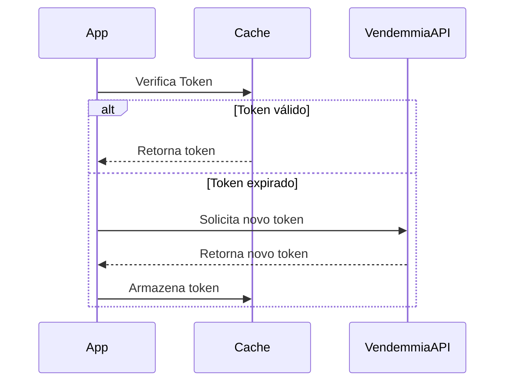

# Documentação - Integração Vendemmia
**Data de Criação:** 2025-02-19  
**Autor:** Leonardo Gomes Raimundo
**Versão:** 1.0

## Sumário
1. [Visão Geral](#1-visão-geral)
2. [Escopo Técnico](#2-escopo-técnico)
3. [Arquitetura da Solução](#3-arquitetura-da-solução)
4. [Configuração do Sistema](#4-configuração-do-sistema)
5. [Cronograma de Desenvolvimento](#5-cronograma-de-desenvolvimento)
6. [Processos de Integração](#6-processos-de-integração)
7. [Tratamento de Erros](#7-tratamento-de-erros)
8. [Monitoramento](#8-monitoramento)
9. [Procedimentos Operacionais](#9-procedimentos-operacionais)
10. [Segurança](#10-segurança)
11. [Anexos](#11-anexos)

## 1. Visão Geral
Integração com a API da Vendemmia para sincronização de dados de produtos, estoque, recebimentos, expedições e seus andamentos.

### 1.1. Objetivos
- Automatizar o processo de integração com a Vendemmia
- Garantir sincronização confiável de dados
- Manter rastreabilidade das operações

### 1.2. Tecnologias Principais
- Microsoft Visual Studio 2022
- C# .NET 8.0
- Hangfire (agendamento de jobs)
- SQL Server (persistência)
- Serilog (logs)
- HTTPS (comunicação segura)

## 2. Escopo Técnico

### 2.1. Endpoints Integrados
1. **Autenticação**
   - Obtenção e gerenciamento de token
   - Renovação automática (55 minutos)

2. **API-WMS-020 - Adicionar um produto**
   - Cadastro e atualização de produtos
   - Sincronização a cada 30 minutos

3. **API-WMS-008 - Adicionar estoque**
   - Atualização de níveis de estoque
   - Sincronização a cada 15 minutos

4. **API-WMS-006 - Adicionar um recebimento**
   - Registro de recebimentos
   - Sincronização a cada 10 minutos

5. **API-WMS-010 - Adicionar uma expedição**
   - Registro de expedições
   - Sincronização a cada 5 minutos

6. **API-WMS-011 - Adicionar andamento da expedição**
   - Atualização de status
   - Sincronização a cada 3 minutos

## 3. Arquitetura da Solução

### 3.1. Componentes do Sistema
```
src/
├── VendemmiaIntegration.Core/           # Lógica de negócios
├── VendemmiaIntegration.Infrastructure/ # Acesso a dados e API
├── VendemmiaIntegration.Worker/         # Serviço Windows
└── VendemmiaIntegration.Tests/          # Testes unitários
```

### 3.2. Banco de Dados
```sql
CREATE TABLE IntegrationLogs (
    Id BIGINT IDENTITY(1,1),
    Timestamp DATETIME2,
    EndPoint VARCHAR(50),
    RequestData NVARCHAR(MAX),
    ResponseData NVARCHAR(MAX),
    Status VARCHAR(20),
    ErrorMessage NVARCHAR(MAX)
);

CREATE TABLE ProcessingControl (
    Id BIGINT IDENTITY(1,1),
    EntityType VARCHAR(50),
    LastProcessedId VARCHAR(100),
    LastProcessingDate DATETIME2,
    Status VARCHAR(20)
);
```

## 4. Configuração do Sistema

### 4.1. Arquivo de Configuração
```json
{
  "Vendemmia": {
    "ApiBaseUrl": "https://api.vendemmia.com.br",
    "Username": "",
    "Password": "",
    "TokenRefreshIntervalMinutes": 55
  },
  "JobConfiguration": {
    "ProductSyncIntervalMinutes": 30,
    "StockSyncIntervalMinutes": 15,
    "ReceiptSyncIntervalMinutes": 10,
    "ShipmentSyncIntervalMinutes": 5,
    "ShipmentProgressSyncIntervalMinutes": 3
  },
  "Serilog": {
    "MinimumLevel": {
      "Default": "Information",
      "Override": {
        "Microsoft": "Warning",
        "System": "Warning"
      }
    }
  },
  "ConnectionStrings": {
    "DefaultConnection": "Server=.;Database=VendemmiaIntegration;Trusted_Connection=True;MultipleActiveResultSets=true"
  }
}
```

## 5. Cronograma de Desenvolvimento

### 5.1. Visão Geral
- **Duração Total:** 52 dias úteis
- **Recurso:** 1 analista/desenvolvedor
- **Metodologia:** Desenvolvimento sequencial

### 5.2. Fases do Projeto

#### Fase 1: Preparação e Setup (8 dias úteis)
- **Primeira Etapa (5 dias)**
  - Configuração do ambiente
  - Setup do projeto .NET 8
  - Configurações iniciais

- **Segunda Etapa (3 dias)**
  - Estrutura base do projeto
  - Configuração Hangfire
  - Setup banco de dados

#### Fase 2: Desenvolvimento Core (20 dias úteis)
- **Primeira Etapa (7 dias)**
  - Cliente HTTP e autenticação
  - Endpoint de Produtos
  - Testes unitários iniciais

- **Segunda Etapa (7 dias)**
  - Endpoint de Estoque
  - Endpoint de Recebimentos
  - Testes unitários

- **Terceira Etapa (6 dias)**
  - Endpoint de Expedições
  - Endpoint de Andamento
  - Finalização dos testes

#### Fase 3: Testes e Ajustes (10 dias úteis)
- **Período de Testes (6 dias)**
  - Testes de integração
  - Testes de carga
  - Ajustes e correções

- **Período de Documentação (4 dias)**
  - Documentação técnica
  - Revisão de código
  - Preparação para homologação

#### Fase 4: Homologação (8 dias úteis)
- **Primeira Etapa (5 dias)**
  - Deploy em homologação
  - Testes em homologação
  - Ajustes necessários

- **Segunda Etapa (3 dias)**
  - Correções finais
  - Documentação de homologação
  - Preparação para produção

#### Fase 5: Produção (6 dias úteis)
- **Implantação (3 dias)**
  - Preparação do ambiente
  - Deploy em produção
  - Configuração de monitoramento

- **Estabilização (3 dias)**
  - Monitoramento inicial
  - Ajustes finais
  - Documentação final

### 5.3. Marcos do Projeto
1. Infraestrutura base (8 dias)
2. Desenvolvimento core (28 dias acumulados)
3. Testes finalizados (38 dias acumulados)
4. Homologação concluída (46 dias acumulados)
5. Produção estável (52 dias acumulados)

## 6. Processos de Integração

### 6.1. Fluxo de Dados


## 7. Tratamento de Erros

### 7.1. Estratégias de Retry
```csharp
public class RetryPolicy
{
    public const int MaxRetries = 3;
    public const int DelayInSeconds = 5;
    public const int MaxDelayInSeconds = 30;
}
```

### 7.2. Circuit Breaker
```csharp
public class CircuitBreakerPolicy
{
    public const int FailureThreshold = 5;
    public const int BreakDurationInSeconds = 30;
}
```

## 8. Monitoramento

### 8.1. Métricas
- Taxa de sucesso das integrações
- Tempo de resposta
- Volume processado
- Erros por tipo

### 8.2. Alertas
- Falhas de autenticação
- Erros consecutivos
- Indisponibilidade da API

## 9. Procedimentos Operacionais

### 9.1. Instalação
1. Scripts de banco de dados
2. Configuração de ambiente
3. Deploy da aplicação
4. Configuração de logs

### 9.2. Backup
- Backup diário do banco
- Retenção de 30 dias
- Verificação de integridade

## 10. Segurança

### 10.1. Requisitos
- HTTPS obrigatório
- Autenticação via token
- Rotação de credenciais
- Logs de auditoria

### 10.2. Dados Sensíveis
- Credentials em Key Vault
- Encryption em repouso
- Mascaramento nos logs

## 11. Anexos

### 11.1. Modelos de Dados
```csharp
public class ProductModel
{
    public string Id { get; set; }
    public string Name { get; set; }
    public string SKU { get; set; }
    public decimal Price { get; set; }
    public string Category { get; set; }
}

public class StockModel
{
    public string ProductId { get; set; }
    public int Quantity { get; set; }
    public string Warehouse { get; set; }
    public DateTime UpdateDate { get; set; }
}

public class ShipmentModel
{
    public string Id { get; set; }
    public string OrderId { get; set; }
    public DateTime ShipDate { get; set; }
    public string Status { get; set; }
    public List<ShipmentItem> Items { get; set; }
}

public class ShipmentProgressModel
{
    public string ShipmentId { get; set; }
    public string Status { get; set; }
    public DateTime UpdateDate { get; set; }
    public string Location { get; set; }
    public string Comments { get; set; }
}
```

### 11.2. Códigos de Erro
```json
{
  "ERROR_001": "Falha na autenticação",
  "ERROR_002": "Token expirado",
  "ERROR_003": "Produto não encontrado",
  "ERROR_004": "Estoque insuficiente",
  "ERROR_005": "Dados inválidos"
}
```
